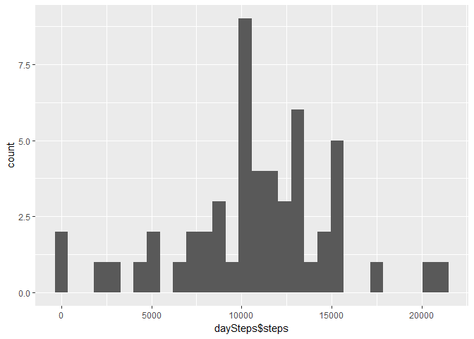
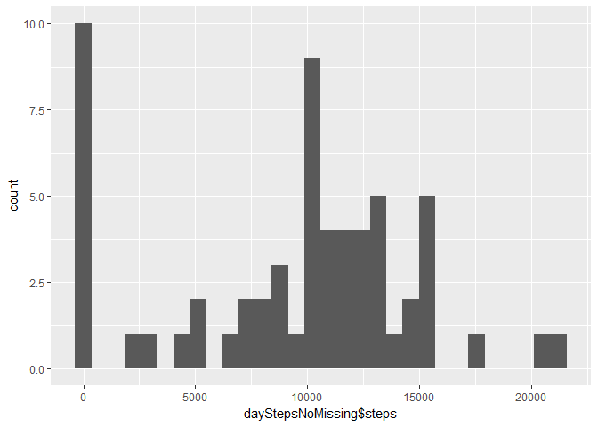
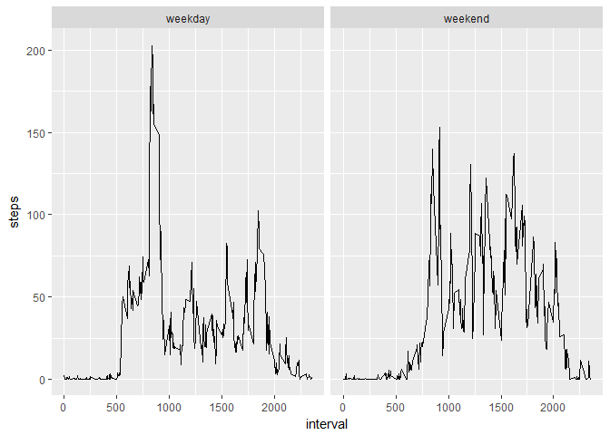

## Loading and preprocessing the data

To load data we're using *read.csv* function. As the second column is the date, we convert it to the proper data type. Then we have a look at the first few rows.


```r
activityData <- read.csv('activity.csv')
activityData$date <- as.Date(activityData$date)
head(activityData)
```

```
##   steps       date interval
## 1    NA 2012-10-01        0
## 2    NA 2012-10-01        5
## 3    NA 2012-10-01       10
## 4    NA 2012-10-01       15
## 5    NA 2012-10-01       20
## 6    NA 2012-10-01       25
```

## What is mean total number of steps taken per day?
To calculate the number of steps taken every day we aggregate number of steps by date using sum as the aggregation function. We use the results to plot the histogram.


```r
daySteps <- aggregate(steps ~ date, activityData, FUN=sum)

library(ggplot2)
```

```
## Warning: package 'ggplot2' was built under R version 3.4.3
```

```r
qplot(daySteps$steps, geom="histogram", bins=30)
```

<!-- -->

```r
summary(daySteps$steps)
```

```
##    Min. 1st Qu.  Median    Mean 3rd Qu.    Max. 
##      41    8841   10765   10766   13294   21194
```

Summary finction gives us information about mean (10766) and median (10765) for the number of steps per day.

## What is the average daily activity pattern?
To plot the time series for the 5 minute interval we first aggregate the number of steps using mean as the aggregation function. The result gives us input data for the plot.


```r
intervalsSteps <- aggregate(steps ~ interval, activityData, FUN=mean)
qplot(interval, steps, data=intervalsSteps, geom="path")
```

<!-- -->

```r
intervalsSteps[which.max(intervalsSteps$steps), ]
```

```
##     interval    steps
## 104      835 206.1698
```

Using *which.max* function we get the information that the 104th row contains the data for the maximum number of steps and that it's the 835th interval.

## Imputing missing values

Counting the number of rows containing NA as the number of steps gives us the number of 2304. To handle the missing data we've chosen to use the mean value for the specific day. We use the *getDayMean* function to apply it to the newly created data frame: *noMissingValues*.

Then we aggregate the new data by using sum function to calculate total number of steps for every day.


```r
nrow(activityData[is.na(activityData$steps),])
```

```
## [1] 2304
```

```r
dayMeans <- aggregate(steps ~ date, activityData, FUN=mean)
getDayMean <- function(date){
  dayMean <- dayMeans[dayMeans$date == date,]$steps[1]
  if (is.na(dayMean))
    dayMean <- 0
  dayMean
}

noMissingValues <- activityData
noMissingValues$steps <- apply(activityData, 1, function(x) { 
    steps <- x['steps']
    if (is.na(steps)){
      steps <- getDayMean(x['date'])
    }
    as.numeric(steps)
  })

dayStepsNoMissing <- aggregate(steps ~ date, noMissingValues, FUN=sum)
qplot(dayStepsNoMissing$steps, geom="histogram", bins=30)
```

<!-- -->

```r
summary(dayStepsNoMissing$steps)
```

```
##    Min. 1st Qu.  Median    Mean 3rd Qu.    Max. 
##       0    6778   10395    9354   12811   21194
```

Summary information gives us mean of 9354 and median 10395. Both of those values decreased after filling in the missing data. So did the minimum value. This isn't surprising as we introduced not only mean data, but also values of 0 where there were no data for the specific days.

## Are there differences in activity patterns between weekdays and weekends?
We used *factor* to produce a new variable indicating the type of the day. It was used to split the plot into panels later. To produce the plot the data was aggregated using *mean* as a function and steps ~ interval + weekday as the formula.


```r
noMissingValues$weekday <- factor(ifelse(weekdays(noMissingValues$date) %in% c("Saturday", "Sunday"), "weekend", "weekday"))

intervalsWeekSteps <- aggregate(steps ~ interval + weekday, noMissingValues, FUN=mean)

ggplot(intervalsWeekSteps, aes(interval, steps)) + geom_line() + facet_wrap(~weekday)
```

<!-- -->

